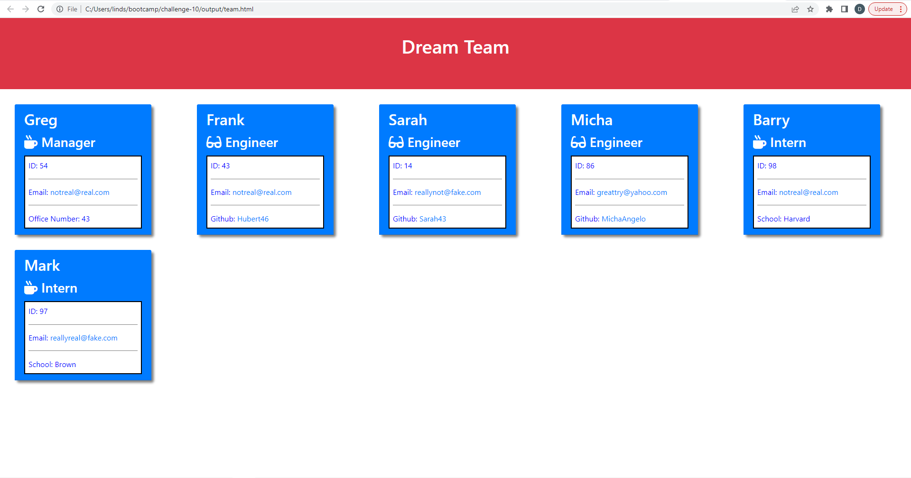

# <Team-Profile_generator>

## Description

Provides a landing page where you can view your project teammates, their role, and contact info.

- My motivation to create this app was to easily be able to connect with teammates about a speific project.
- I built this to have a template for future use and easily streamline any future project.
- This app solves the breakdown in communication problem, and eliminates excuses.
- This app build taught me about Object Oriented Programming, and the importance of writing tests.

## Table of Contents 

If your README is long, add a table of contents to make it easy for users to find what they need.

- [Installation](#installation)
- [Usage](#usage)
- [Screenshot](#screenshot)
- [Walk-Through Video](#walk-through-video)

## Installation

To use install the Inquirer package with
    npm i inquirer@8.2.4

## ScreenShot

    
## Walk-Through Video

https://drive.google.com/file/d/1TNeF_o6cZetAkgeTN06GJsE2Po205l9h/view

## Tests

To run the tests open the test folder in the integrated terminal and run: "npm install jest".